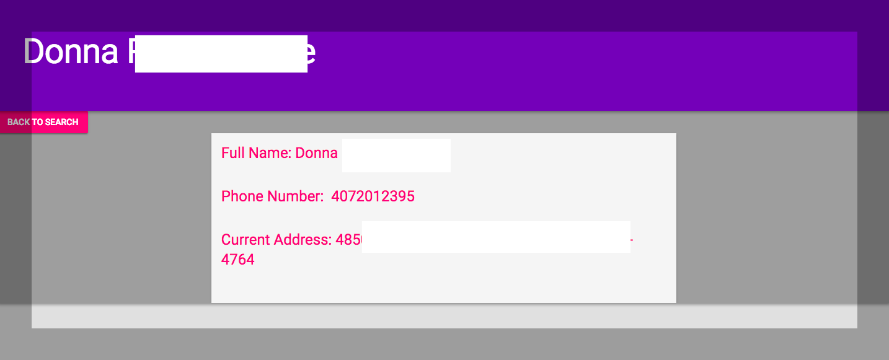

Phone-Lookup
===============

Description
-----------

* A simple MVP of an reverse phone number search (like Truecaller or Hiya).
* Uses the truepeoplesearch.com API to match phone numbers to names, addresses.
* Written in Go.
* This project uses [Redis](http://redis.io), to store results. 
* Please make sure you have the latest version of Docker installed. 

Setup
-----

     cd $GOPATH/src
     mkdir -p github.com/swiftdiaries
     cd github.com/swiftdiaries/
     git clone github.com/swiftdiaries/phone-lookup
     cd phone-lookup
     docker-compose up
     
     Go to http://localhost:8080/ on your browser.

Landing Page
-----------------
  

Sample Results
--------------

     
     
